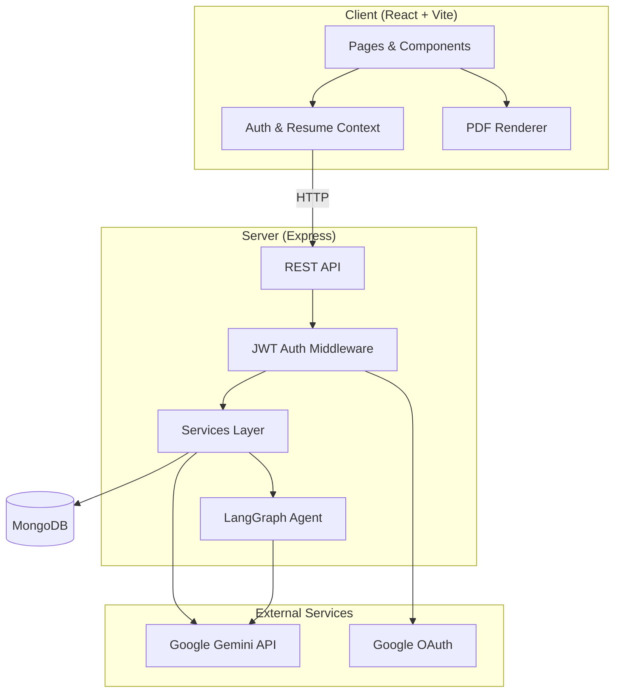

# AI Resume Builder

An intelligent, full-stack resume builder that combines a polished editing experience with AI-powered writing, ATS optimization, and professional PDF export. Build tailored resumes for every application—backed by Google Gemini and a multi-agent workflow.

---

## Table of Contents

- [Overview](#overview)
- [Features](#features)
- [Tech Stack](#tech-stack)
- [Architecture](#architecture)
- [Project Structure](#project-structure)
- [Prerequisites](#prerequisites)
- [Getting Started](#getting-started)
- [Environment Variables](#environment-variables)
- [Available Scripts](#available-scripts)
- [API Reference](#api-reference)
- [Resume Templates](#resume-templates)
- [Roadmap](#roadmap)
- [License](#license)

---

## Overview

AI Resume Builder is a MERN-style application with a React frontend and Node.js/Express backend. Users can create resumes from scratch or import existing PDFs, edit content in a live split-screen builder, collaborate with an AI chat assistant, and export ATS-friendly PDFs.

The platform is designed for job seekers who want more than a static template—intelligent bullet rewrites, job-description matching, skill-gap analysis, and a 10-metric ATS scoring engine help you iterate quickly and apply with confidence.

---

## Features

### Resume Builder
- **Split-screen editor** — Section-based sidebar with live preview
- **Auto-save** — Changes persist automatically with debounced updates
- **Five professional templates** — Classic, Modern, Creative, Minimal, and Executive
- **PDF export** — Download polished, print-ready resumes via `@react-pdf/renderer`
- **PDF import** — Upload an existing resume and continue editing in the app

### AI-Powered Intelligence
- **Conversational chat assistant** — Rewrite sections, ask for improvements, or build content through natural dialogue
- **Multi-agent system** — LangGraph ReAct agent with tool calling for autonomous resume updates
- **STAR bullet generation** — Transform raw experience into impact-driven, metric-focused bullet points
- **Summary writer** — Generate professional summaries from your profile data
- **Job matching** — Align resume content with a target job description
- **Skill gap analysis** — Identify missing skills relative to a role

### ATS Optimization
- **10-metric scoring engine** — Keyword match, bullet quality, formatting, section completeness, summary strength, skill coverage, quantification, action verbs, length, and contact info
- **Actionable feedback** — Missing keywords and improvement suggestions
- **AI + algorithmic hybrid** — Combines rule-based analysis with Gemini-powered review

### Account & Workflow
- **Authentication** — Email/password registration and Google OAuth
- **Dashboard** — Manage all resumes in one place
- **Version history** — Save, compare, restore, and delete resume snapshots

---

## Tech Stack

| Layer | Technologies |
|-------|-------------|
| **Frontend** | React 19, Vite 6, Tailwind CSS 4, React Router 7 |
| **PDF** | `@react-pdf/renderer` |
| **Backend** | Node.js, Express 5, MongoDB, Mongoose |
| **AI** | Google Gemini (`gemini-2.5-flash`), LangChain, LangGraph |
| **Auth** | JWT, bcrypt, Google OAuth (`@react-oauth/google`) |
| **Utilities** | Multer (file upload), pdfjs-dist (PDF parsing), Zod |

---

## Architecture



---

## Project Structure

```
resume_bulider/
├── client/                     # React frontend
│   ├── src/
│   │   ├── components/         # UI components, forms, templates, PDF layouts
│   │   ├── context/            # AuthContext, ResumeContext
│   │   ├── pages/              # Landing, Login, Home, Dashboard, Builder, Versions
│   │   ├── services/           # API client & domain services
│   │   └── constants/          # Templates, section types
│   └── package.json
│
└── server/                     # Express backend
    ├── src/
    │   ├── config/             # Database, Gemini, Google OAuth
    │   ├── controllers/        # Route handlers
    │   ├── middleware/         # Auth, file upload
    │   ├── models/             # Mongoose schemas (User, Resume, ChatHistory, etc.)
    │   ├── routes/             # API route definitions
    │   ├── services/           # Business logic & AI orchestration
    │   └── utils/              # ATS scoring, keyword analysis, PDF parsing
    ├── server.js               # Application entry point
    └── package.json
```

---

## Prerequisites

Before you begin, ensure you have the following installed:

- **Node.js** 18 or later
- **npm** 9 or later
- **MongoDB** — local instance or [MongoDB Atlas](https://www.mongodb.com/atlas) cluster
- **Google Cloud project** with:
  - [Gemini API key](https://aistudio.google.com/apikey)
  - [OAuth 2.0 Client ID](https://console.cloud.google.com/apis/credentials) (for Google Sign-In)

---

## Getting Started

### 1. Clone the repository

```bash
git clone <repository-url>
cd resume_bulider
```

### 2. Install dependencies

```bash
# Backend
cd server
npm install

# Frontend
cd ../client
npm install
```

### 3. Configure environment variables

Create `.env` files in both `server/` and `client/` (see [Environment Variables](#environment-variables)).

### 4. Start the development servers

```bash
# Terminal 1 — Backend (from server/)
npm run dev

# Terminal 2 — Frontend (from client/)
npm run dev
```

| Service  | Default URL                    |
|----------|--------------------------------|
| Frontend | http://localhost:5173          |
| Backend  | http://localhost:5000          |
| API base | http://localhost:5000/api      |

Open the frontend URL in your browser, create an account, and start building your resume.

---

## Environment Variables

### Server (`server/.env`)

```env
# Server
PORT=5000
NODE_ENV=development
CLIENT_URL=http://localhost:5173

# Database
MONGODB_URI=mongodb://localhost:27017/resume-builder

# Authentication
JWT_SECRET=your_super_secret_jwt_key
JWT_EXPIRES_IN=7d
GOOGLE_CLIENT_ID=your_google_oauth_client_id

# AI
GEMINI_API_KEY=your_gemini_api_key
```

### Client (`client/.env`)

```env
VITE_API_URL=http://localhost:5000/api
VITE_GOOGLE_CLIENT_ID=your_google_oauth_client_id
```

> **Note:** Never commit `.env` files to version control. Both `client/.gitignore` and `server/.gitignore` already exclude them.

---

## Available Scripts

### Client

| Command | Description |
|---------|-------------|
| `npm run dev` | Start Vite development server |
| `npm run build` | Build for production |
| `npm run preview` | Preview production build locally |

### Server

| Command | Description |
|---------|-------------|
| `npm run dev` | Start server with file watching |
| `npm start` | Start server in production mode |

---

## API Reference

All protected routes require a valid JWT in the `Authorization` header:

```
Authorization: Bearer <token>
```

### Authentication

| Method | Endpoint | Description |
|--------|----------|-------------|
| `POST` | `/api/auth/register` | Register with email and password |
| `POST` | `/api/auth/login` | Login with email and password |
| `POST` | `/api/auth/google` | Authenticate via Google OAuth |
| `GET`  | `/api/auth/me` | Get current user profile |
| `POST` | `/api/auth/logout` | Logout |

### Resumes

| Method | Endpoint | Description |
|--------|----------|-------------|
| `POST` | `/api/resumes` | Create a new resume |
| `GET`  | `/api/resumes` | List all resumes for the user |
| `GET`  | `/api/resumes/:id` | Get a single resume |
| `PUT`  | `/api/resumes/:id` | Update resume metadata |
| `PUT`  | `/api/resumes/:id/sections/:section` | Update a specific section |
| `PUT`  | `/api/resumes/:id/template` | Change template |
| `POST` | `/api/resumes/upload` | Import resume from PDF |
| `DELETE` | `/api/resumes/:id` | Delete a resume |

### AI

| Method | Endpoint | Description |
|--------|----------|-------------|
| `POST` | `/api/ai/chat` | Chat with the interview agent |
| `POST` | `/api/ai/generate-bullets` | Generate STAR-format bullets |
| `POST` | `/api/ai/generate-summary` | Generate professional summary |
| `POST` | `/api/ai/ats-score` | Calculate ATS score |
| `POST` | `/api/ai/review` | Full AI resume review |
| `POST` | `/api/ai/match-job` | Match resume to job description |
| `POST` | `/api/ai/skill-gaps` | Analyze skill gaps |
| `GET`  | `/api/ai/chat-history/:resumeId` | Retrieve chat history |

### Versions

| Method | Endpoint | Description |
|--------|----------|-------------|
| `POST` | `/api/versions/:resumeId` | Save a version snapshot |
| `GET`  | `/api/versions/:resumeId` | List all versions |
| `GET`  | `/api/versions/:resumeId/:versionId` | Get a specific version |
| `POST` | `/api/versions/:resumeId/:versionId/restore` | Restore a version |
| `DELETE` | `/api/versions/:resumeId/:versionId` | Delete a version |

---

## Resume Templates

| Template | Style | Best For |
|----------|-------|----------|
| **Classic Professional** | Traditional single-column, ATS-friendly | Corporate, finance, government |
| **Modern Tech** | Two-column with sidebar | Software engineering, product, design |
| **Creative Bold** | Vibrant accents, eye-catching layout | Marketing, creative roles |
| **Minimal Clean** | Generous whitespace, elegant simplicity | Consulting, academia |
| **Executive** | Dark header, structured layout | Senior leadership, C-suite |

Each template includes a matching PDF export layout for consistent on-screen and downloaded output.

---

## Roadmap

- [ ] Cover letter generation
- [ ] LinkedIn profile import
- [ ] Collaborative editing
- [ ] Additional export formats (DOCX)
- [ ] Public resume sharing links

---

## License

This project is licensed under the **ISC License**.

---

<p align="center">
  Built with React, Express, MongoDB, and Google Gemini
</p>
